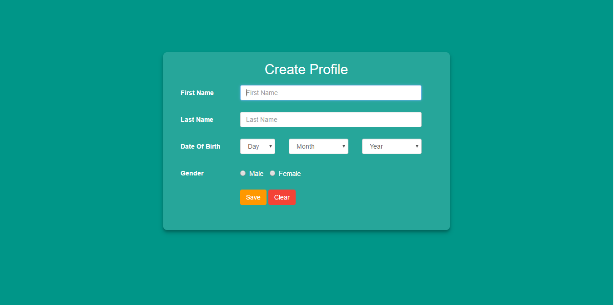
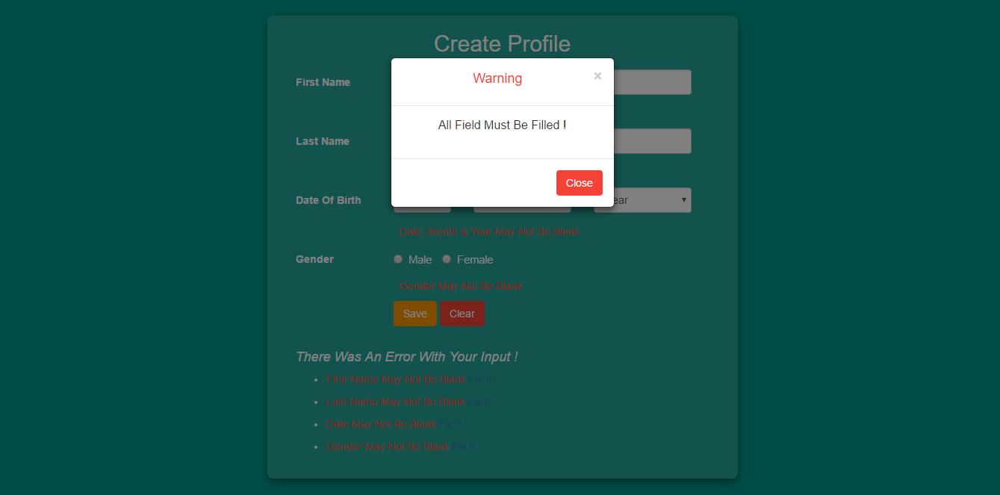
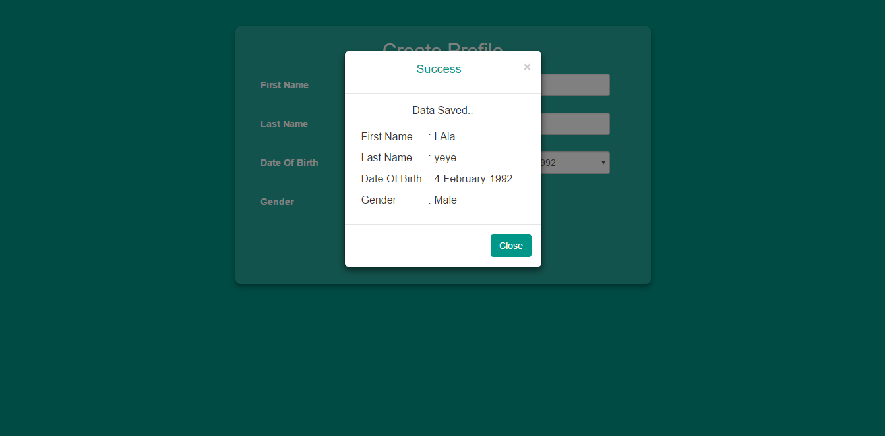

# Praktikum 5 Dasar Pemrograman Web

## Language

-  
-  
-  

## Test coverage

-  html
-  javascript
-  css

## Screenshot

- ScreenShot 1

    

- ScreenShot 2

    

- ScreenShot 3

    

## License
> This program is Free Software: You can use, study, share and improve it at your
will. Specifically you can redistribute and/or modify it under the terms of the
[GNU General Public License](https://www.gnu.org/licenses/gpl.html) as
published by the Free Software Foundation, either version 3 of the License, or
(at your option) any later version.
