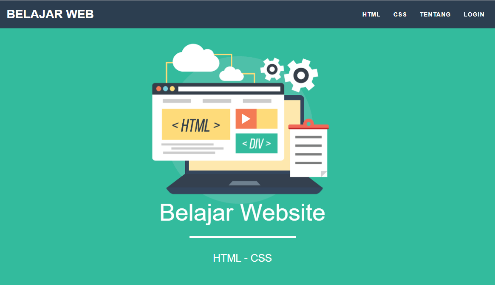

# Kelas-Praktikum-Dasar-Pemrograman-Web
Project Kelas dan Praktikum Mata Kuliah Dasar Pemrograman Web

## Project Akhir Dasar Pemrograman Web

## Language

-  
-  
-  
-  
-  

## Test coverage

-  html
-  css
-  javascript
-  json
-  php

## Screenshot

- ScreenShot 1

    

- ScreenShot 2

    

- ScreenShot 3

    

- ScreenShot 4

    

- ScreenShot 5

    
    
## License
> This program is Free Software: 
You can use, study, share and improve it at your will. 
Specifically you can redistribute and/or modify it under the terms of the [GNU General Public License](https://www.gnu.org/licenses/gpl.html) 
as published by the Free Software Foundation, either version 3 of the License, or (at your option) any later version.
